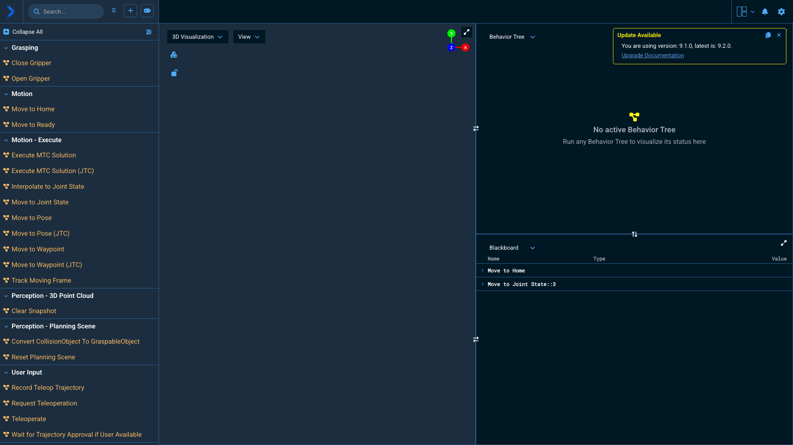

# MoveIt Pro — Standard Bots Workspace

[MoveIt Pro](https://picknik.ai/moveit-pro/) configuration packages for [Standard Bots](https://standardbots.com/) robot arms.

Forked from [`PickNikRobotics/moveit_pro_empty_ws`](https://github.com/PickNikRobotics/moveit_pro_empty_ws). Customer engagements should fork *this* workspace into a `<customer>_ws` repo under `PickNikRoboticsServices` rather than starting from scratch.

## Config Packages

| Package | Robot | Hardware | Status |
|---|---|---|---|
| `sbot_core_base_config` | Standard Bots Core (RO1, 6-DOF, 18 kg payload, 1.3 m reach) | `mock_components/GenericSystem` | Builds, launches, motion verified |

## Robot Description Sources

URDFs and ros2_control hardware interface stubs are pulled from Standard Bots' public repo as a git submodule:

- [`standardbots/ros2-realtime-api`](https://github.com/standardbots/ros2-realtime-api) → `src/external_dependencies/standardbots_ros2_realtime_api/`
  - URDFs: `core.urdf`, `spark.urdf`, `thor.urdf` (in `src/robot_urdfs/`)

> **Mesh limitation.** The upstream URDFs reference STL meshes from a `standard_bots_description` ROS package that is **not** in the public realtime-api repo. `sbot_core_base_config/description/sbot_core.urdf` is a hand-edited copy of `core.urdf` with every `<mesh>` reference replaced by a sized cylinder/box derived from the link's adjacent-joint origin. Inertials, joint axes, and joint limits are unchanged from upstream. The result is a buildable, plannable arm that renders as a stick-figure approximation rather than the photorealistic CAD. To switch back to real meshes, replace `sbot_core.urdf` with the upstream file once Standard Bots provides the mesh package.

## Setup

```bash
git clone --recurse-submodules git@github.com:PickNikRobotics/moveit_pro_standard_bots_ws.git
cd moveit_pro_standard_bots_ws
```

Then point MoveIt Pro at the workspace and a config package:

```bash
moveit_pro configure -w "$PWD" -c sbot_core_base_config
moveit_pro build
moveit_pro run
```

Web UI: <http://localhost> (or the VM's IP if running in a Parallels VM).

## Test motions

Two objectives are wired up for `sbot_core_base_config`:

- **Move to Home** — non-singular elbow-up tucked pose `[0.0, -0.6, 1.2, -0.6, 0.0, 0.0]`
- **Move to Ready** — visibly distinct test pose `[0.7, -1.2, 1.6, -0.4, 0.5, 0.0]`

Click either in the web UI's Motion category, or send via ROS action from inside the agent_bridge or drivers container:

```bash
ros2 action send_goal /do_objective \
  moveit_studio_sdk_msgs/action/DoObjectiveSequence \
  '{objective_name: "Move to Ready"}'
```

## Stop

```bash
moveit_pro down
```

## Mac + Parallels host workflow notes

If you're driving `moveit_pro` over SSH from a Mac into a Parallels Linux VM, the wrapper requires `DISPLAY` and `XAUTHORITY` in the SSH session — even for mock configs that do no rendering. See [`docs_nonpublic/Developer-Mac-Guide.md`](https://github.com/PickNikRobotics/moveit_pro/blob/main/docs_nonpublic/Developer-Mac-Guide.md) in the main moveit_pro repo for the full workaround.

## Workspace UI



> Note: the 3D viewport is blank in this capture because the screenshot tool (Playwright headless Chromium) cannot initialize WebGL. In a real browser, the stick-figure arm renders correctly.
